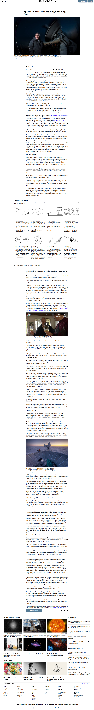

# newyork-times-article-page / Positioning and Floating Elements

This project is the clone version of newyork-times-article-page. In the process of making this website, me and my partner covered some best techniques like float, position, grid, flex property which made our project more flexible.

# Original Design

Original Design link : [nytimes.com](https://www.nytimes.com/2014/03/18/science/space/detection-of-waves-in-space-buttresses-landmark-theory-of-big-bang.html?_r=0)

# Project Design

Project Design Screenshot : 

# Github link:

For the: [Github-link](https://github.com/ahmadchata/newyork-times-article-page/tree/feature-homepage)

# Project flow

## Navigation bar

- Used flex to create three division one for icon, second one for logo and last one for button.

## Image section

- Used figure and figcaption and put an image to the center. 

## Article section

- Embedded videos using iframe, insert images and paragraphs in this section.

## Inflation section

- Used one image as background and create division using grid for each section.
- Relative position property is used for the image.

## Editor's section

- Use aside tag for this grid division.

## Footer section

- float property is used to put logo in one side and text in other side.
- Flex box are used
- Fixed footer is made using fixed property.

# Technology Used

- HTML
- CSS
- Font Awesome icons

# Authors

## Ahmad Chata

- Github - @ahmadchata
- Twitter - @ahmadchata
- Linkedin - https://www.linkedin.com/in/ahmad-chata-957b9b51/

## Dipesh Kumar

- Github: @Dipeshtwis
- Twitter: @97deepeshkumar
- Linkedin: https://www.linkedin.com/in/dipesh-kumar-b6ab88134/

